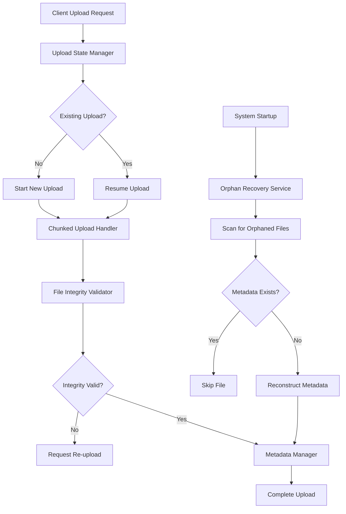

# Design Document

## Overview

The upload recovery system will enhance the existing video upload infrastructure to handle network interruptions, resume uploads, and recover orphaned files. The design focuses on maintaining backward compatibility while adding robust recovery mechanisms through persistent state management, chunked uploads with resumption capabilities, and automated orphan detection.

## Architecture

### Core Components

1. **Upload State Manager** - Manages persistent upload state and recovery information
2. **Chunked Upload Handler** - Handles resumable uploads with chunk-level verification
3. **Orphan Recovery Service** - Detects and recovers orphaned video files
4. **Upload Progress Tracker** - Provides real-time progress updates with persistence
5. **File Integrity Validator** - Ensures file integrity during and after uploads

### System Flow



## Components and Interfaces

### Upload State Manager

```typescript
interface UploadState {
  uploadId: string;
  videoId: string;
  filename: string;
  clientName: string;
  projectName: string;
  totalSize: number;
  uploadedSize: number;
  chunkSize: number;
  lastChunkIndex: number;
  checksumMD5?: string;
  startTime: Date;
  lastActivity: Date;
  status: 'active' | 'paused' | 'failed' | 'completed';
  retryCount: number;
  maxRetries: number;
}

class UploadStateManager {
  async saveUploadState(state: UploadState): Promise<void>
  async loadUploadState(uploadId: string): Promise<UploadState | null>
  async updateUploadProgress(uploadId: string, uploadedSize: number): Promise<void>
  async markUploadComplete(uploadId: string): Promise<void>
  async markUploadFailed(uploadId: string, error: string): Promise<void>
  async cleanupExpiredUploads(): Promise<void>
  async getActiveUploads(): Promise<UploadState[]>
}
```

### Chunked Upload Handler

```typescript
interface ChunkInfo {
  index: number;
  size: number;
  offset: number;
  checksum: string;
  uploaded: boolean;
}

class ChunkedUploadHandler {
  async initializeUpload(metadata: UploadInitRequest): Promise<UploadState>
  async uploadChunk(uploadId: string, chunkIndex: number, data: Buffer): Promise<ChunkResult>
  async resumeUpload(uploadId: string): Promise<UploadState>
  async finalizeUpload(uploadId: string): Promise<VideoMetadata>
  async validateChunk(data: Buffer, expectedChecksum: string): Promise<boolean>
  async assembleFile(uploadId: string): Promise<string>
}
```

### Orphan Recovery Service

```typescript
interface OrphanFile {
  path: string;
  size: number;
  createdDate: Date;
  videoId: string;
}

class OrphanRecoveryService {
  async scanForOrphans(): Promise<OrphanFile[]>
  async recoverOrphan(orphan: OrphanFile): Promise<VideoMetadata | null>
  async reconstructMetadata(orphan: OrphanFile): Promise<VideoMetadata | null>
  async validateOrphanFile(orphan: OrphanFile): Promise<boolean>
  async cleanupInvalidOrphans(): Promise<number>
}
```

### File Integrity Validator

```typescript
class FileIntegrityValidator {
  async calculateChecksum(filePath: string): Promise<string>
  async validateFileIntegrity(filePath: string, expectedChecksum: string): Promise<boolean>
  async validateChunkIntegrity(data: Buffer, expectedChecksum: string): Promise<boolean>
  async repairCorruptedFile(filePath: string, uploadState: UploadState): Promise<boolean>
}
```

## Data Models

### Enhanced Upload State Storage

```typescript
// uploads/state/{uploadId}.json
interface UploadStateFile {
  uploadId: string;
  videoId: string;
  metadata: {
    filename: string;
    clientName: string;
    projectName: string;
    totalSize: number;
  };
  progress: {
    uploadedSize: number;
    chunkSize: number;
    lastChunkIndex: number;
    completedChunks: number[];
  };
  integrity: {
    expectedChecksum?: string;
    chunkChecksums: { [index: number]: string };
  };
  timing: {
    startTime: Date;
    lastActivity: Date;
    estimatedCompletion?: Date;
  };
  status: {
    current: 'active' | 'paused' | 'failed' | 'completed';
    retryCount: number;
    maxRetries: number;
    lastError?: string;
  };
}
```

### Orphan Recovery Metadata

```typescript
// uploads/recovery/orphans.json
interface OrphanRegistry {
  lastScan: Date;
  orphans: {
    [videoId: string]: {
      discoveredDate: Date;
      filePath: string;
      fileSize: number;
      recoveryAttempts: number;
      lastRecoveryAttempt?: Date;
      recoveryStatus: 'pending' | 'recovered' | 'failed' | 'invalid';
      reconstructedMetadata?: Partial<VideoMetadata>;
    };
  };
}
```

## Error Handling

### Network Interruption Recovery

1. **Connection Loss Detection**: Monitor upload stream for connection errors
2. **State Preservation**: Save upload state before each chunk
3. **Resume Logic**: Calculate resume position from last successful chunk
4. **Retry Mechanism**: Implement exponential backoff for failed chunks

### File Corruption Handling

1. **Chunk-level Validation**: Verify each chunk with MD5 checksums
2. **File-level Validation**: Verify complete file integrity after assembly
3. **Corruption Detection**: Compare expected vs actual checksums
4. **Recovery Actions**: Request re-upload of corrupted chunks or entire file

### Orphan File Recovery

1. **Automatic Detection**: Scan for video files without metadata on startup
2. **Metadata Reconstruction**: Extract information from file paths and properties
3. **Validation**: Verify file integrity before recovery
4. **Fallback Handling**: Provide manual recovery options for complex cases

## Testing Strategy

### Unit Tests

1. **Upload State Manager**
   - State persistence and retrieval
   - Progress tracking accuracy
   - Cleanup of expired uploads

2. **Chunked Upload Handler**
   - Chunk upload and validation
   - File assembly from chunks
   - Resume functionality

3. **Orphan Recovery Service**
   - Orphan detection accuracy
   - Metadata reconstruction
   - File validation

4. **File Integrity Validator**
   - Checksum calculation
   - Integrity validation
   - Corruption detection

### Integration Tests

1. **End-to-End Upload Recovery**
   - Simulate network interruptions
   - Verify successful resume
   - Validate final file integrity

2. **Orphan Recovery Workflow**
   - Create orphaned files
   - Verify automatic detection
   - Validate successful recovery

3. **Concurrent Upload Handling**
   - Multiple simultaneous uploads
   - State isolation
   - Resource management

### Performance Tests

1. **Large File Handling**
   - Upload files up to 25GB
   - Measure memory usage
   - Verify performance with chunking

2. **Recovery Performance**
   - Resume time for various file sizes
   - Orphan scan performance
   - State management overhead

### Error Simulation Tests

1. **Network Failure Scenarios**
   - Connection drops at various points
   - Intermittent connectivity
   - Timeout conditions

2. **File System Errors**
   - Disk space exhaustion
   - Permission issues
   - Corrupted file scenarios

3. **Concurrent Access**
   - Multiple clients uploading
   - State file conflicts
   - Resource contention